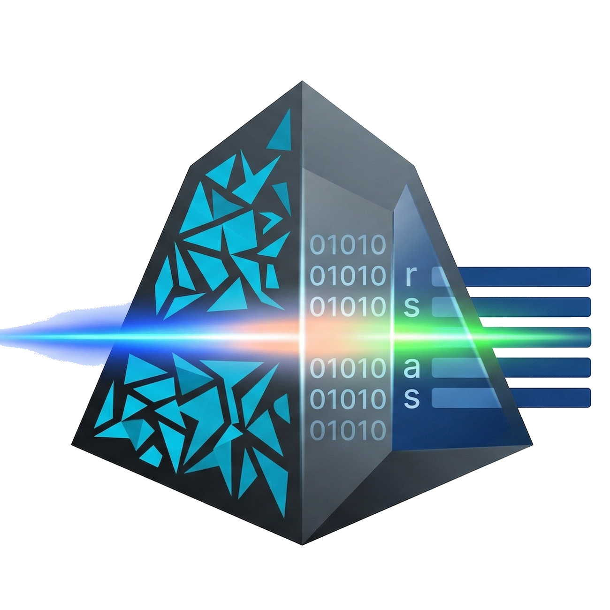

<div align="center">



# Rosetta

**A local-first desktop workspace for documents you plan to revisit.**

An open-source local-first desktop app for reading, translating, indexing, and querying long-form documents.

[English](README.md) | [简体中文](README.zh-CN.md)

[](LICENSE)


[Download](https://github.com/somnifex/Rosetta/releases) | [Quick Start](#quick-start) | [Build from Source](#build-from-source) | [Contributing](#contributing)

</div>

## Why Rosetta

Most document tools are built for a quick pass: upload, translate, export, forget. Rosetta is for the documents that stay with you a little longer.

It keeps long-form PDFs and text files inside one continuous workflow: library, reader, translation pipeline, index, and source-grounded chat. Import a document once, then keep working from the same material over time.

## Design Principles

- Local first. Documents, indexes, prompts, and generated artifacts live on your machine, in your system app data directory.
- Structure-aware. Rosetta tries to preserve layout and document structure before flattening everything into plain text.
- Configurable where it matters. `chat`, `translate`, `embed`, and `rerank` can each use different providers, models, and runtime settings.
- Built for return visits. A document can still be translated, indexed, searched, extracted, and discussed long after it was imported.

## What You Can Do

- Build a persistent library with folders, categories, tags, and reusable metadata extraction templates.
- Parse PDFs through MinerU, using the built-in runtime, a self-hosted service, or the official MinerU API.
- Read original and translated content in separate or side-by-side views.
- Route `chat`, `translate`, `embed`, and `rerank` work through dedicated provider channels.
- Tune translation prompts, chunking strategy, concurrency, rate limits, and failover behavior.
- Search your library with both direct matching and semantic retrieval.
- Ask questions against documents and inspect the supporting sources.
- Track parse, translation, and indexing jobs in a unified task center.
- Export local backups or sync workspace data over WebDAV.

## Good Fit

- Research papers, standards, manuals, and technical reports you revisit over weeks or months
- Internal documentation that benefits from bilingual reading and reliable source tracking
- Personal or internal knowledge bases built from real documents instead of loose notes
- Translation workflows where terminology, provenance, and later retrieval all matter

## Quick Start

### 1. Download

Get the latest release from [GitHub Releases](https://github.com/somnifex/Rosetta/releases).

| Platform | Package formats         |
| -------- | ----------------------- |
| Windows  | `.msi`, `.exe`      |
| macOS    | `.dmg`                |
| Linux    | `.deb`, `.AppImage` |

### 2. First Run

1. Install and open Rosetta.
2. Go to `Settings` and configure at least one AI provider channel.
3. Choose a MinerU mode: built-in, external, or official API.
4. Import a document into your library.
5. Run `Parse -> Translate -> Index`.
6. Continue in `Search`, `Chat`, or the document reader.

### 3. Typical Workflow

```text
Import -> Parse -> Translate -> Index -> Read / Search / Chat -> Backup
```

## Build from Source

Requirements:

- Node.js 18+
- Rust stable
- Tauri 2 prerequisites
- Python 3.x for the built-in MinerU runtime or the optional zvec backend

```bash
git clone https://github.com/somnifex/Rosetta.git
cd Rosetta
npm install
npm run tauri:dev
```

## Data and Privacy

Rosetta is local-first by default. Runtime data is stored in your system app data directory rather than inside the repository workspace.

Typical stored data includes:

- imported document copies
- SQLite metadata and indexes
- MinerU runtime files and downloaded models
- local cache, generated outputs, and backup artifacts

Rosetta only talks to the external services you configure. You decide which providers to use and what content leaves the machine.

## Roadmap

- [x] Document library management
- [x] MinerU integration
- [x] Multi-channel model routing
- [x] Search and source-grounded chat
- [x] WebDAV sync and local backup
- [x] Multilingual interface
- [ ] Batch translation workflows
- [ ] Richer annotation and review tools
- [ ] More export and collaboration options

## Contributing

Contributions are welcome in UX, reliability, parsing quality, translation quality, documentation, and platform support.

Before opening a pull request, please run:

```bash
npm run build
cd src-tauri && cargo check
```

## License

Rosetta is licensed under the [GNU General Public License v3.0](LICENSE).

## Acknowledgments

- [Tauri](https://tauri.app/)
- [MinerU](https://github.com/opendatalab/MinerU)
- [Radix UI](https://www.radix-ui.com/)
- [shadcn/ui](https://ui.shadcn.com/)
- Rosetta also owes a quiet debt to the issue threads, forum posts, and troubleshooting notes shared across [GitHub](https://github.com/), [Reddit](https://www.reddit.com/), and [Linux.do](https://linux.do/). Projects like this are rarely built alone.
